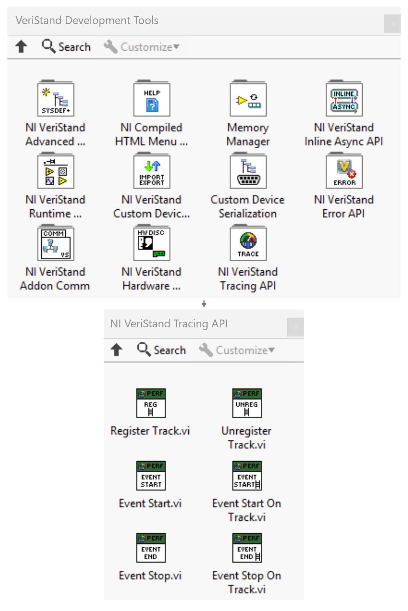

# NI VeriStand Tracing API

The **NI VeriStand Tracing API** provides a set of APIs for adding tracing to NI VeriStand Custom Devices. The APIs allow Custom Device developers to record user-space events within timed structures and custom execution tracks, enabling performance analysis, timing measurements, and execution-flow visualization through traces.

---

## How to Use the APIs

1. The APIs are available in the **NI VeriStand Tracing API** subpalette under **VeriStand Development Tools** in the LabVIEW Functions palette.

2. Add the required APIs to your Custom Device implementation and use the appropriate APIs to record events, depending on whether the code executes inside or outside Timed Structures.
3. Build the Custom Device with tracing enabled.

### Custom Device Express Projects

Custom Device Express projects automatically include a dedicated build specification for tracing. To generate a trace-enabled Custom Device, build using the Perfetto build specification provided in the project.

### Existing Custom Devices

Trace logging is disabled by default. To build a trace-enabled version of an existing Custom Device, add the following **Conditional Disable Symbol** to the project:

- **Symbol Name:** `ENABLE_PERFETTO`
- **Value:** `TRUE`

---

## APIs for Recording Events Inside Timed Structures

These APIs are used to record events that execute within Timed Loops or Timed Sequences.

### Event Start

Starts an event on the current timed structure thread.

**Parameters**  
• **Event Name** – Name of the event displayed in the trace.

**Notes**  
• Must be paired with `Event Stop`.  
• Events appear on the track corresponding to the timed structure name.

---

### Event Stop

Ends the active event started using `Event Start`.

**Parameters**  
• None.

---

### Note

`Event Start` and `Event Stop` can be used inside the **Read Data from HW** and **Write Data to HW** cases of inline Hardware Interface custom devices, as these execute in the VeriStand engine's primary control loop.

---

## APIs for Recording Events Outside Timed Structures

These APIs are used to record events outside Timed Loops or when events need to be associated with custom tracks.

### Register Track

Creates a custom track that appears as a separate timeline in the trace.

**Parameters**  
• **Track ID** – Unique identifier for the track.  
• **Track Name** – Display name of the track shown in the trace.

---

### Event Start On Track

Starts an event on a registered custom track.

**Parameters**  
• **Track ID** – Identifier of the registered track.  
• **Event Name** – Name of the event displayed in the trace.

---

### Event Stop On Track

Ends the active event on the specified custom track.

**Parameters**  
• **Track ID** – Identifier of the track on which the event was started.

---

### Unregister Track

Removes a previously registered custom track.

**Parameters**  
• **Track ID** – Identifier of the track to unregister.

---

### Note

• `Register Track` must be called before using `Event Start On Track` or `Event Stop On Track`.  
• `Event Start On Track` and `Event Stop On Track` must be used as a pair.  
• Unregister tracks when event recording is complete.