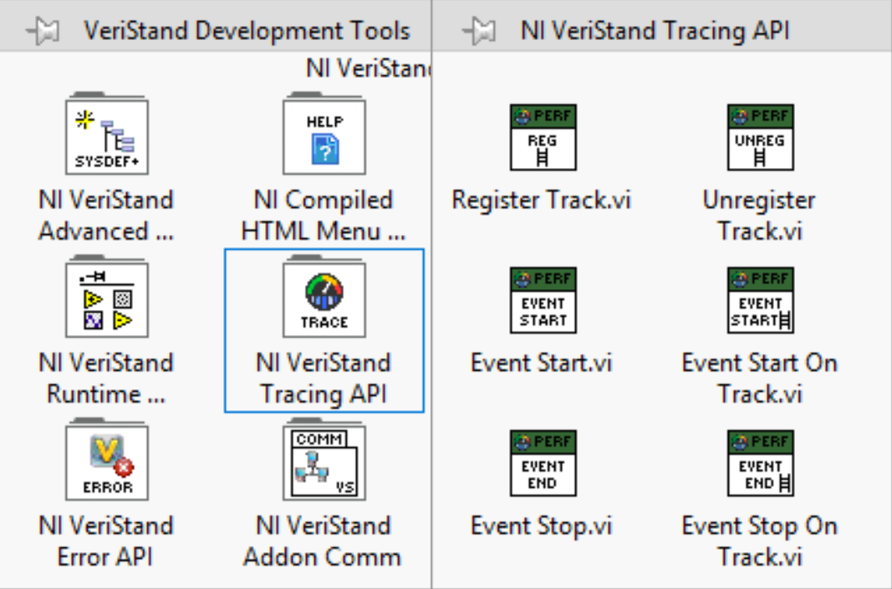
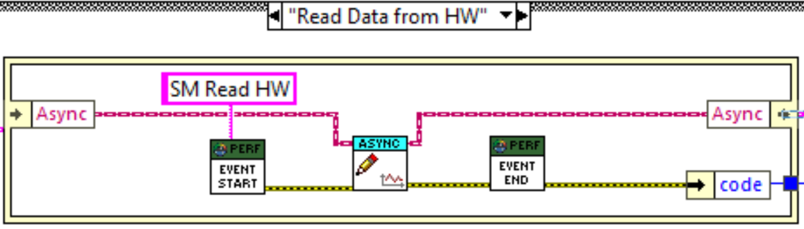
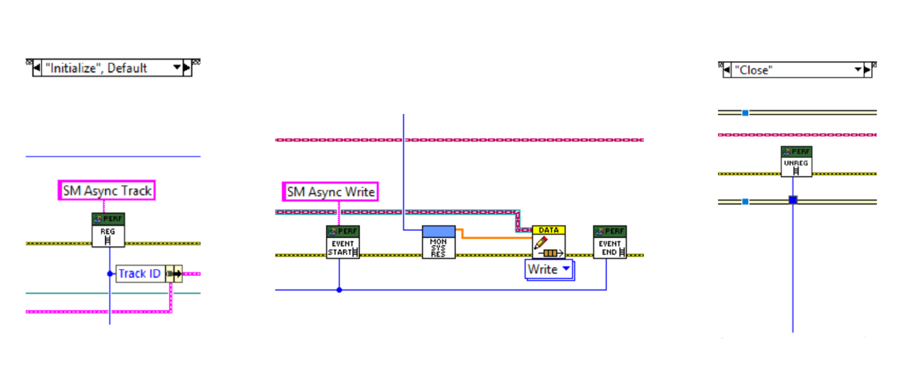

# NI VeriStand Tracing API

The **NI VeriStand Tracing API** provides a set of APIs for adding trace instrumentation to NI VeriStand Custom Devices. These APIs allow Custom Device developers to record user-space events within timed structures and custom execution tracks, enabling performance analysis, timing measurements, and execution-flow visualization through traces.

The tracing implementation is based on **Perfetto**, an open-source tracing framework for performance instrumentation and trace analysis. Perfetto provides efficient event collection, storage, and visualization capabilities and is used by the NI VeriStand Tracing API to generate trace data for analysis.

> **Note:** The NI VeriStand Tracing API is supported only on **Linux Real-Time targets**. Trace generation and collection are not supported on Windows targets.

---

# Using the APIs

The APIs are available in the **NI VeriStand Tracing API** subpalette under **VeriStand Development Tools** in the LabVIEW Functions palette.

Use the APIs appropriate to the execution context:

- Use **Event Start** and **Event Stop** when code executes inside a Timed Loop or Timed Sequence.
- Use **Register Track**, **Event Start On Track**, **Event Stop On Track**, and **Unregister Track** when code executes outside timed structures or when events need to be displayed on a custom execution track.

## APIs for Recording Events Inside Timed Structures

### Event Start

Starts a trace event with the specified **Event Name** on the current timed structure.

Use this VI when you want to begin measuring the execution of a section of code running inside a Timed Loop, Timed Sequence, or another timed execution context.

---

### Event Stop

Ends the active trace event started by **Event Start**.

Use this VI at the end of the code section being measured to record the event duration in the trace.

### Note

- **Event Start** and **Event Stop** must always be used as a pair.
- **Event Start** and **Event Stop** can also be used in the **Read Data from HW** and **Write Data to HW** cases of inline Hardware Interface Custom Devices, since these execute within the VeriStand engine's primary control loop.

---

## APIs for Recording Events Outside Timed Structures

### Register Track

Creates a custom trace track with the specified **Track Name** that appears as a separate timeline in the trace viewer.

Use this VI before recording events from execution contexts that are not associated with a timed structure, such as background processes, asynchronous tasks, or custom threads.

---

### Event Start On Track

Starts a trace event with the specified **Event Name** on a previously registered custom track.

Use this VI when you want to measure the execution time of code running outside a timed structure and display it on a specific custom track in the trace.

---

### Event Stop On Track

Ends the active event on a registered custom track.

Use this VI at the end of the code section being measured to record the event duration on the custom track.

---

### Unregister Track

Removes a previously registered custom trace track.

Use this VI when tracing on the track is complete and the track is no longer needed. After a track has been unregistered, no additional events can be recorded on that track unless it is registered again.

### Note

- Call **Register Track** before recording events on a custom track.
- Use the **Track ID** output from **Register Track** as the input to **Event Start On Track**, **Event Stop On Track**, and **Unregister Track**.
- **Event Start On Track** and **Event Stop On Track** must always be used as a pair.
- Call **Unregister Track** when tracing activities on the custom track are complete.
- Custom tracks are intended for asynchronous execution contexts and code that executes outside timed structures.

---

# Building a Trace-Enabled Custom Device

Trace logging is disabled by default.

To build a trace-enabled Custom Device:

1. Open **Project Properties**.
2. Add the following **Conditional Disable Symbols**:

   - **Symbol Name:** `ENABLE_PERFETTO`
   - **Value:** `TRUE`

3. Build the Custom Device using the project's build specification.

When the `ENABLE_PERFETTO` symbol is set to `TRUE`, the build includes the required Perfetto tracing libraries, producing a trace-enabled Custom Device capable of generating trace data for analysis.

---

# Generating and Analyzing Traces

Traces are automatically captured while the VeriStand project is running and are generated when the project is undeployed.

For more information, refer to:
https://www.ni.com/docs/en-US/bundle/veristand/page/engine-tracing.html
